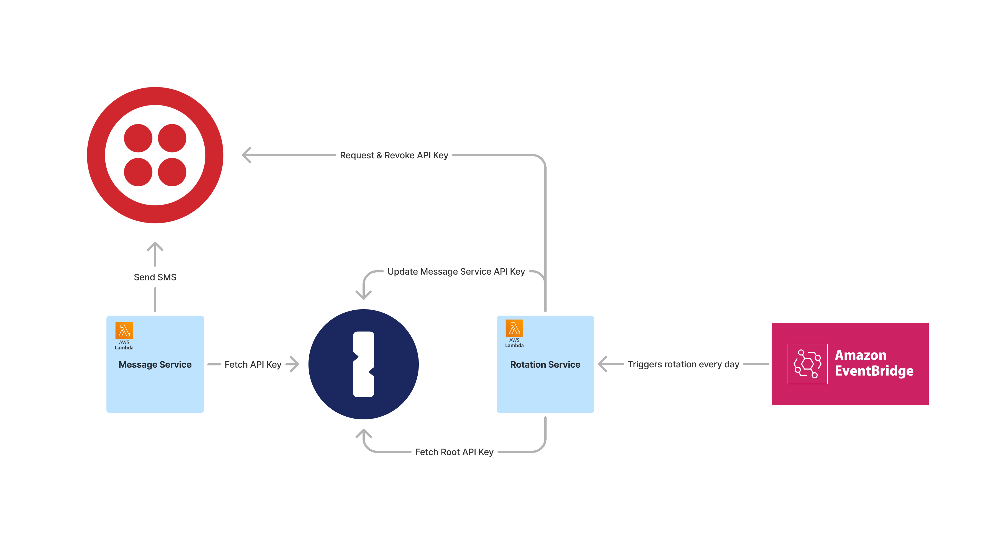

# 1Password SDKs Demos

This repository contains two demos for using [1Password SDKs](https://developer.1password.com/docs/sdks/):

1. [Fetching an API Key](./message-service/), used in AWS Lambda to send an SMS using Twilio.
2. [Rotating that API Key](./rotation-service/)

