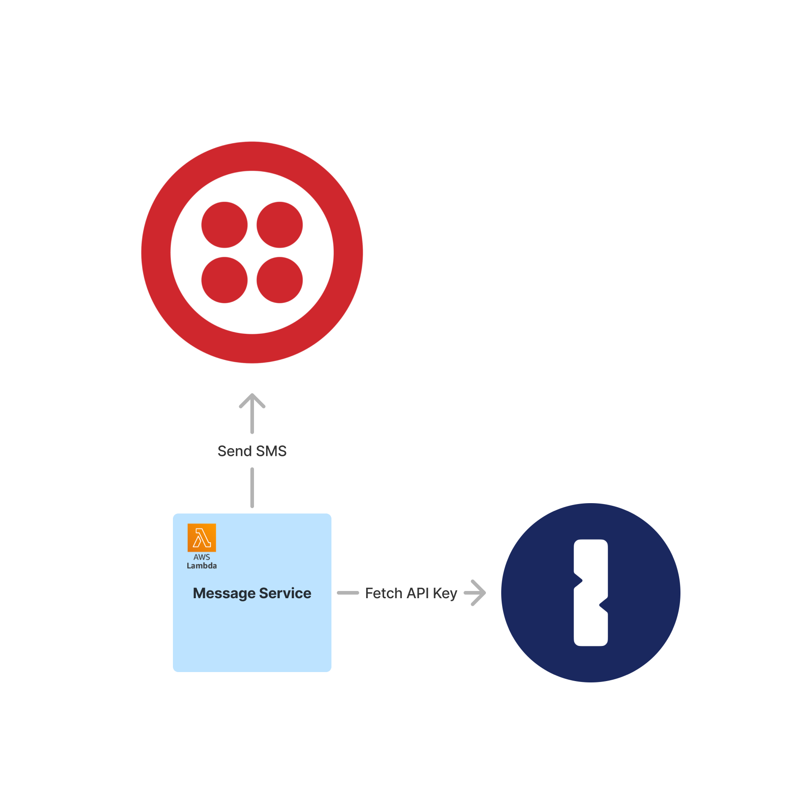
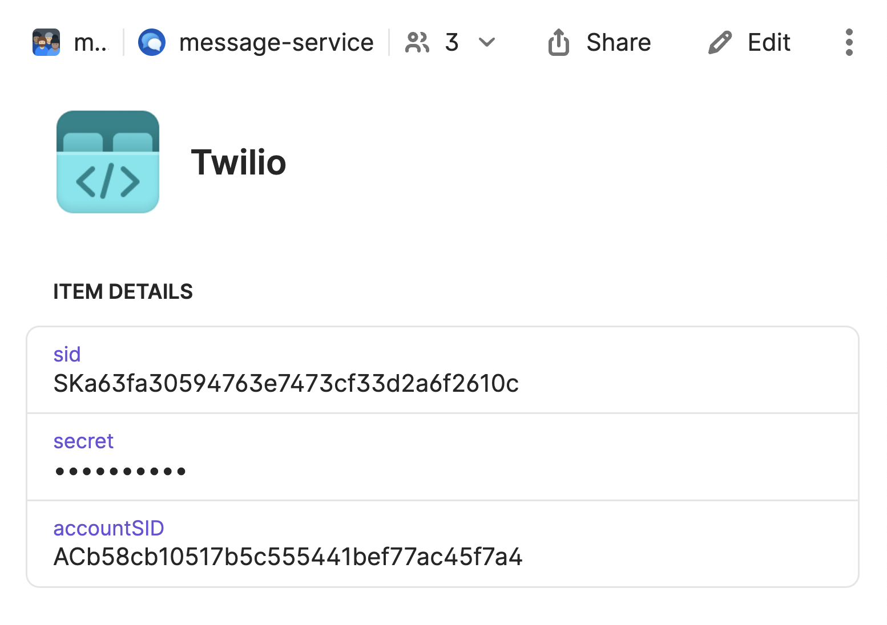
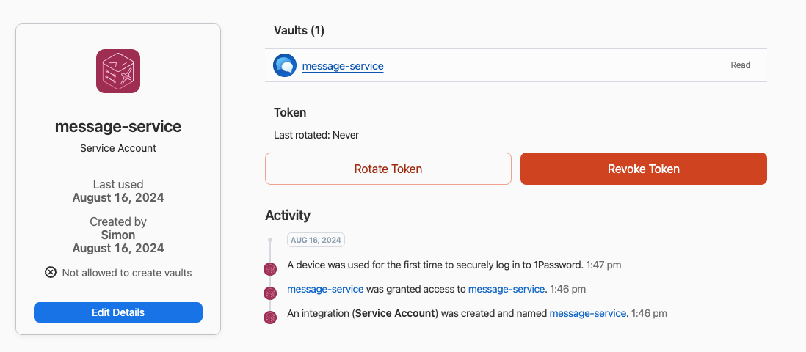
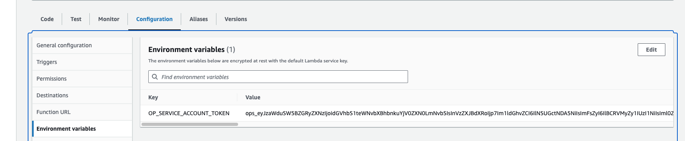

# Read API Token Demo

This directory contains a simple app to demonstrate how you can read an API Key from 1Password to use in your deployed services.

It shows a Lambda function that sends an SMS message using Twilio. To authenticate to Twilio it fetches the required API Key from 1Password.



## Deploy

1. Create an AWS Lambda function. I've used `sdks-demo-message-service` for the name. If you choose a different name, update the command below.

2. Install and authenticate the AWS CLI. I use the [1Password Shell Plugin for AWS](https://developer.1password.com/docs/cli/shell-plugins/aws/) to do so.

3. Upload the code in this repository to the Lambda function:
```sh
zip -r lambdaFunc.zip . && aws lambda update-function-code --function-name sdks-demo-rotation-service --zip-file fileb://./lambdaFunc.zip --region us-east-1
```

4. [Create a 1Password vault](https://support.1password.com/create-share-vaults/). You'll use this to store all secrets this service requires. I've called it `message-service`. If you use a different name for your vault, update the [secret references](https://developer.1password.com/docs/cli/secret-references/) in `index.mjs` to use your vault name instead.

5. [Create a Twilio API Key](https://www.twilio.com/docs/iam/api-keys#create-an-api-key) and [store it in your 1Password vault](https://support.1password.com/1password-com-items/#create-and-edit-items).
   - To authenticate to Twilio, next to the API Key itself, the accountSID is required as well, so I've stored that on the 1Password item too.
   - I've also stored the identifier of the API Key itself (the `sid`) on the item. We'll use this [when we set up automatic rotation for API Keys in the next step](../rotation-service/).



6. [Create a 1Password Service Account](https://developer.1password.com/docs/service-accounts/get-started).

   a. It should have read access to the vault we've just created, so it can fetch the Twilio API Key.

    

   b. In AWS Lambda under Configuration and Environment Variables, set the `OP_SERVICE_ACCOUNT_TOKEN` environment variable to the token of the Service Account you've just created.

    

## Next Steps

Check out [this follow up demo](../rotation-service/) to see how you can expand this with automatic rotation of the API Token used.
