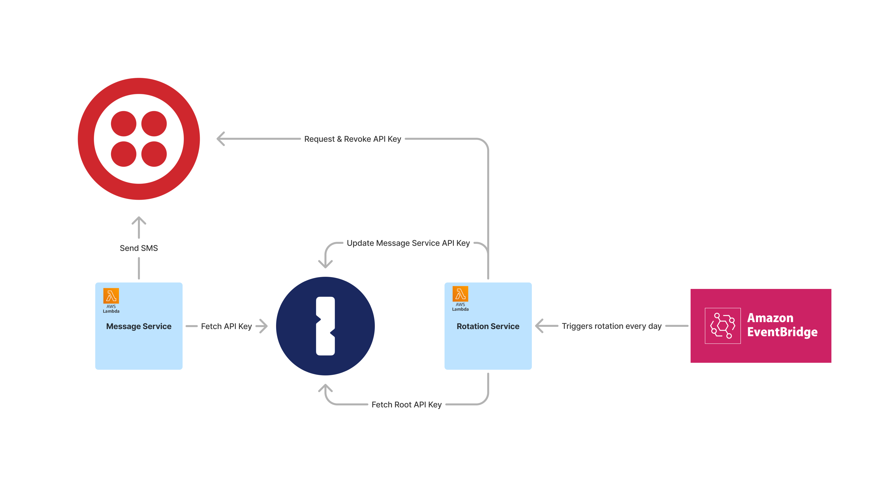
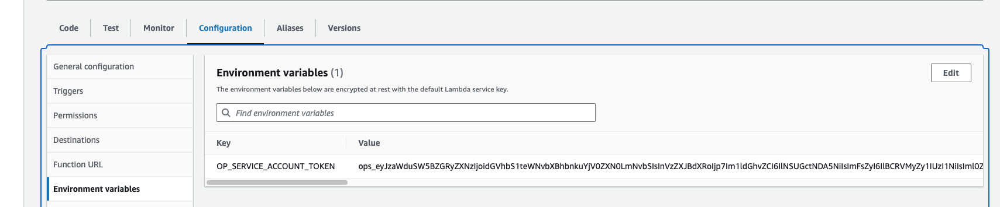
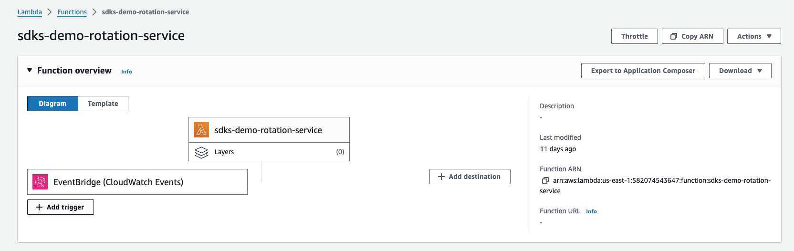

# Rotate API Token Demo

This directory contains a small demo service to demonstrate how you can use [1Password SDKs](https://developer.1password.com/docs/sdks) together with [AWS EventBridge](https://docs.aws.amazon.com/eventbridge/latest/userguide/eb-what-is.html) to automatically rotate secrets on a set schedule (e.g. every day).

For the purposes of this demo, we're going to be rotating the API Key used by the [message service](../message-service/) from the earlier demo.



## Zero Downtime Rotation

We roll the API Keys without any service disruption. To achieve this, we don't immediately revoke the previous API Key. This gives services time to start using the new API Key before their access is blocked.

This lambda function does so by always having two keys active at the same time: the new key and the previous key. When creating a new key, it revokes the key before the previous.

For example, on a 1 hour rotation schedule, every key lives for 2 hours. 1 hour as the current key and 1 hour to be phased out.


## Deploy

1. Create an [AWS Lambda function](console.aws.amazon.com/lambda/home). I've used `sdks-demo-rotation-service` for the name. If you choose a different name, update the command below.


2. Under configuration, set memory to 2048MB. This function is going to do a lot of encryption/decryption to maintain [1Password's end-to-end encryption](https://1password.com/security/). This consumes quite some memory and will be very slow with the default 128MB memory.

 

3. Install and authenticate the AWS CLI. I use the [1Password Shell Plugin for AWS](https://developer.1password.com/docs/cli/shell-plugins/aws/) to do so.

4. Upload the code in this repository to the Lambda function:
```sh
zip -r lambdaFunc.zip . && aws lambda update-function-code --function-name sdks-demo-rotation-service --zip-file fileb://./lambdaFunc.zip --region us-east-1
```

5. [Create a 1Password Service Account](https://developer.1password.com/docs/service-accounts/get-started).
   a. It should have read+write access to the vault with the token it's going to rotate (in our case `message-service`) and read access to a vault that stores the root API Token (in our case `rotation-service`).

    

   b. In AWS Lambda under Configuration and Environment Variables, set the `OP_SERVICE_ACCOUNT_TOKEN` environment variable to the token of the Service Account you've just created.

    

At this point you  should have a working rotation service that you can manually invoke by hitting the "Test" button in AWS Lambda. In the next step we'll set up a trigger so rotation happens automatically without manual action required.

6. Add trigger for AWS Lambda function:

   a. In your Lambda function, click "Add Trigger".
    

   b. Select EventBridge as the source.

   c. Select "Create a new rule"

   d. Fill the rest of the form. I'm using `rate(1 day)` to rotate on a daily basis. You can also define a cron if you prefer to specify an exact date/time. See [Creating a rule that runs on a schedule in Amazon EventBridge
](https://docs.aws.amazon.com/eventbridge/latest/userguide/eb-create-rule-schedule.html) for more options.


